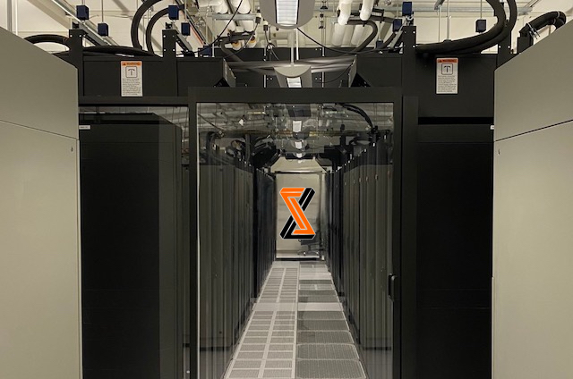

SymbioticLab operates powerful in-house clusters dedicated for SymbioticLab's research.
We have two clusters specialized for memory and GPUs, respectively:

### 6 Memory nodes
- 2 x Intel Xeon Processors
- 512GB DRAM + 512GB Intel Optane DIMM
- 1 x NVIDIA A40 GPU

### 6 GPU nodes
- 2 x AMD EPYC Processors
- 512GB DRAM
- 4 x NVIDIA A40 GPUs

**In total, 30 NVIDIA A40 GPUs, 1440 CPU cores, and 9TB memory, all connected to each other using a 200Gbps Infiniband adaptor. The computing power is more powerful than using eight [AWS p3.8xlarge](https://aws.amazon.com/ec2/instance-types/p3/) instances, which costs $70,500 per month!**