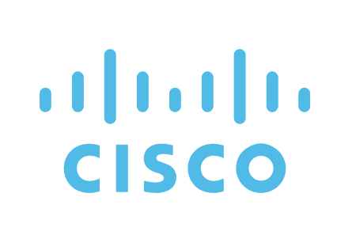
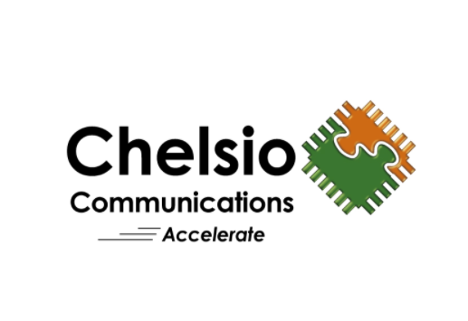


Any opinions, findings, and conclusions of our research projects are those of the author(s) and do not necessarily represent the official policy of any of these organizations.


## Current Sponsors

[comment]: # "Note that there must be a blank line after the div, otherwise the img tag won't be rendered"

## Past Sponsors

